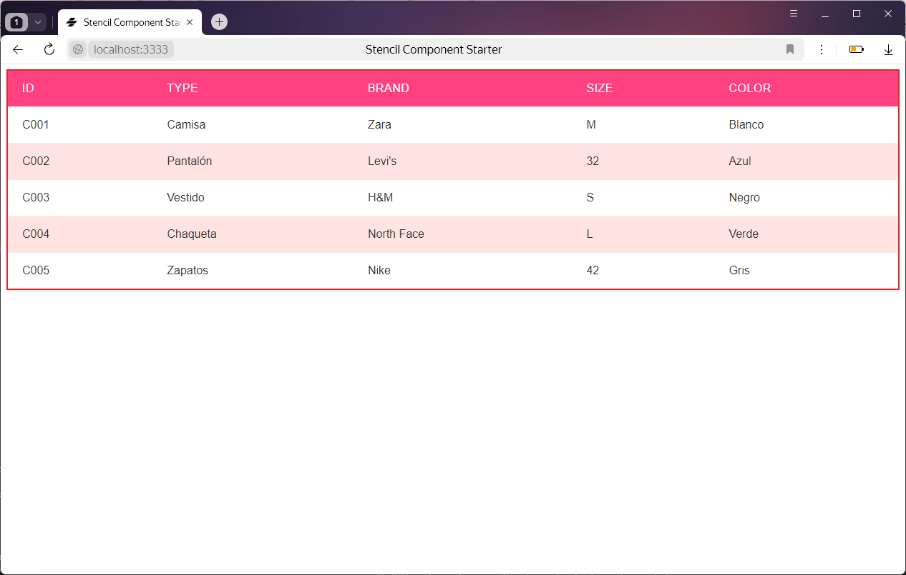

# my-table-cmcaiza1

Este componente Stencil crea una tabla responsiva que se llena dinámicamente con datos obtenidos de una API.

## Funcionalidades

- Obtiene datos automáticamente de la API proporcionada.
- Muestra los datos en una tabla responsiva.
- Maneja errores de red y de formato de datos.
- Estilo personalizado con tema rosa claro.

## Instalación

Clona este repostitorio
```bash
git clone (https://github.com/CherleyMaria/A2_Cherley_Caiza)
```

Dirigite al directorio de proyecto y accede al componente de stencil 
```bash
cd componente-01-cmcaiza1
```


## Desarrollo
- Para iniciar el proyecto en modo desarrollo:
```bash
npm start
```
- Para construir el componente para producción:
```bash
npm run build
```

- Para ejecutar la api
```bash
node api.js
```

## Captura Pantalla

